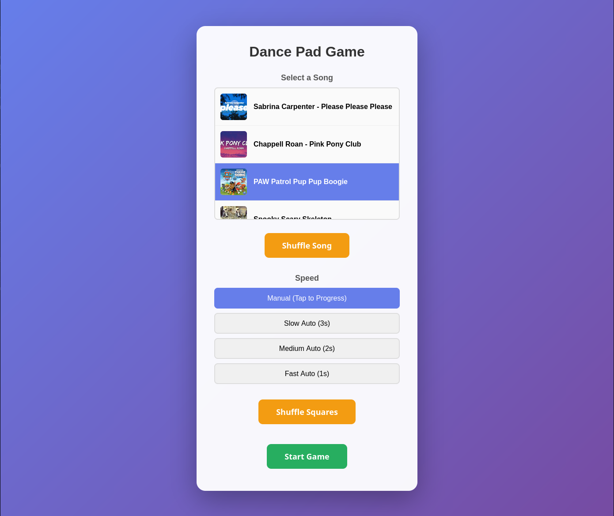
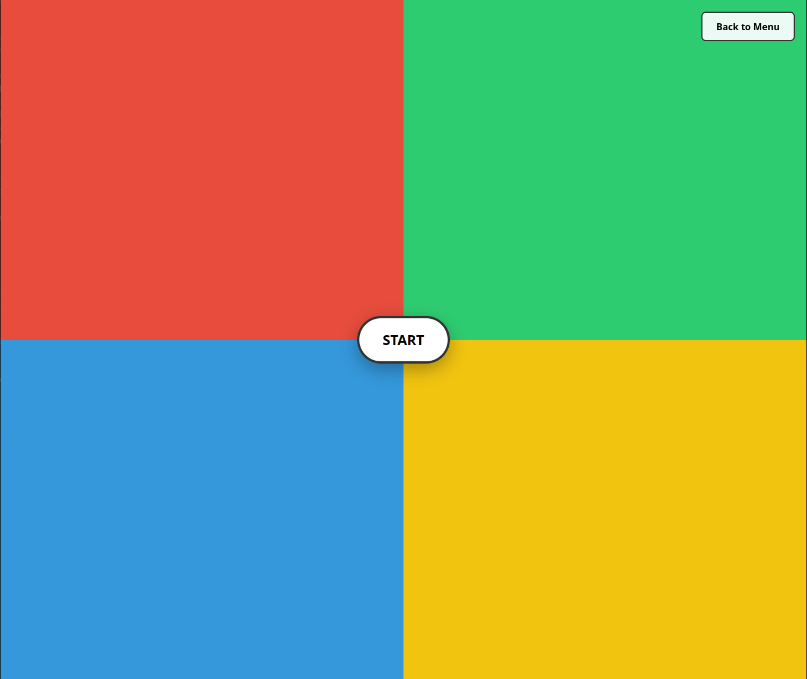
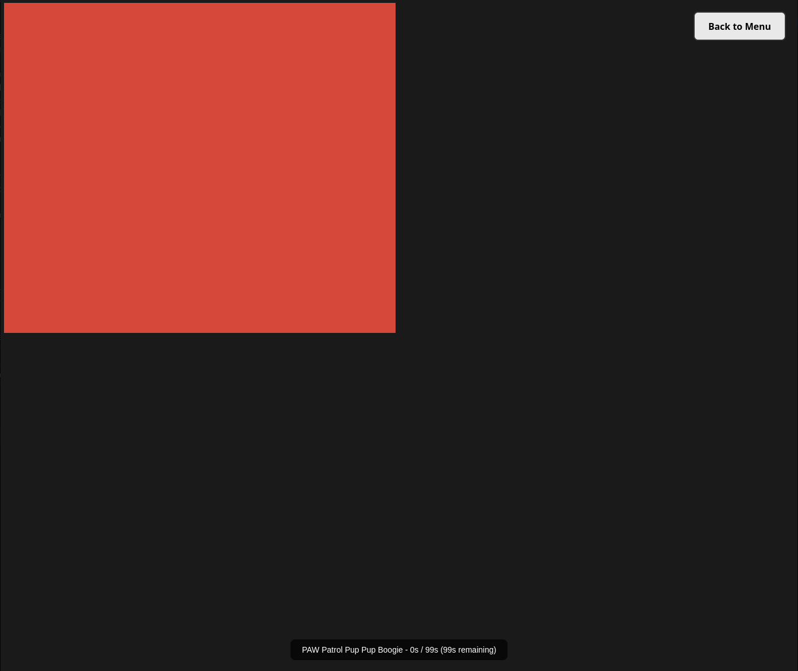

# Pup‑Pup Boogie

> **A simple, colorful dance game for toddlers.**  
>  No points, no counters – just a fun way to move around the room while 
listening to music!


> **AI Usage Disclaimer** – The frontend was generated with Claude AI (by 
Anthropic).  
>  Although I am not an HTML/JS/CSS expert, I have verified that all 
inputs and outputs work as intended.  
>  Treat this as a **black‑box** implementation that you can extend or 
tweak to your heart’s content.

---

## Quick Start

1. **Download / Clone**  
    ```bash
    git clone https://github.com/MarkyXP/pup_pup_boogie.git
    cd pup-pup-boogie
    ```
    [Install UV](https://docs.astral.sh/uv/getting-started/installation/), if you haven't done so previously

2. **Open the Game**  
    Launch the server / game with:
    ```bash
    uv run main.py
    ```
    Then open a web browser to http://localhost:8000/

3. **Play!**  
    - Initially there is a **settings** menu where you can:
        - Select a song to play (if no songs have been downloaded it will just use some royalty free ones)
        - Select the speed for the tiles to transition.
            - Note that there is a 'Manual' speed, where you can tap the screen to transition tiles.
            - The other settings will linger on a tile for the time specified before going to the next tile

        

    - The gameplay itself is based on youtube videos like [this one](https://www.youtube.com/watch?v=sRVdbFiJCXo).
        - The screen is split into 4 squares, you are expected to put 4 squares on the floor with matching colours 
        - The player is to stand on the floor with matching squares (BYO squares. I just have cardboard I cut to size and my son helped colour them with crayons).
        - The game will transition to the next, randomly selected tile as per the settings.

        
        ----
        
    
    - I recommend using your phone in landscape and opening the webpage there, and using screen mirroring to your TV or projector for the best experience.
    
    

## Add Your Own Music  

This is still under development sorry, it's a bit rough around the edges.

1. Find a sond on YouTube. Copy it's URL (e.g. `https://www.youtube.com/watch?v=G8WM8weC8_A`)
2. Navigate to http://localhost:8000/docs
3. Expand the '/api/download_yt' section.
4. Click 'Try it out'
5. Paste the URL into the **link** field.
6. Click **Execute**

If all goes well it should be added to the `/pup-pup-boogie/audio` directory.

---


## Legal Statement

I'm not an expert at this, but it goes without saying that you should only download songs from YouTube where you are legally allowed to, as per your local laws and the YouTube terms of service.  